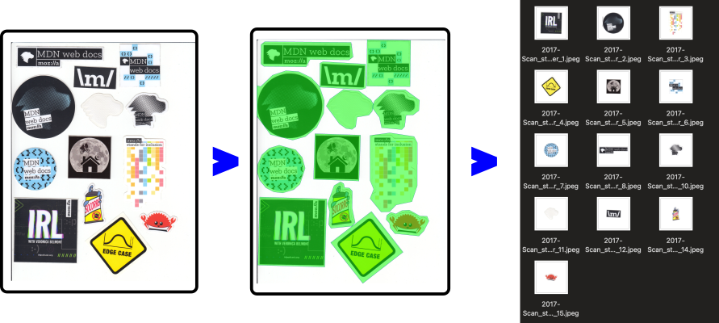

# Autocrop

A set of scripts produced by ChatGPT 4o that will:

1. Automatically detect areas in an image
1. Extract the content of areas as PNG
1. Turn PNG in square JPEG



## How to run

Install dependencies

```
pip install poetry
poetry install
```

And then run the different commands in chain:

```
python image2json.py input/ output/json/ && \
python json2png.py input/ output/json/ output/extracted/ && \
python png2square.py output/extracted/ output/stickaz/
```

Or all commands like clean polygons, visualization, etc.

```
python image2json.py input/ output/json/ && \
python json2visu.py input/ output/json output/visu-all/ && \
python jsonclean.py output/json/ output/json-clean/ && \
python json2visu.py input/ output/json-clean/ output/visu-clean/ && \
python json2png.py input/ output/json-clean/ output/extracted/ && \
python autorotate.py output/extracted/ output/rotated/ && \
python png2square.py output/rotated/ output/stickaz/
```

## Source code

The source code was created using an LLM with the following prompts. This is the first time that I do a full project without coding :) I thought it would be fun to share the prompts I used.

```
I have a bunch of images that are scans of stickers put together on a single sheet

I want a python script that will:

1. Automatically detect and crop each sticker into separate image files.
2. Remove the background around each sticker.
3. Put them in square images
4. Try to detect orientate to fix orientation

If necessary, pull models from huggingface, use PIL, etc.
```

```
this is not working as I expect.

Let's do it in several steps.

First produce a JSON file that will contain the pixels coordinates of the polygons edges around detected stickers (max 100 edges per sticker)

give me a python script that produces a JSON as described from a folder of jpeg files
```


```
OK, now, based on JSON file of pixel coordinates, give a python to extract from the original image by copying the content defined by the polygons, and save them as png
```


```
now put the png of the extracted stickers into squared jpeg with white background
```

```
some of the obvious stickers are not detected in the image.
And one is cropped.

How can I tweak the script that produces the JSON to bbe smarter, and use better AI like from huggingface
```


```
I want to visualize the masks on top of the image
```

```
give a full image to json script that uses this to
_ product a jpeg image in the current folder with the visualized masks
- produces a JSON in the output folder
```

```
it detects too many small polygons, there are like 8 stickers in avergage per sheet.
cluster more
Also make sure each sticker is surrounded by a semi white area
```

```
grow the polygon by 20 pixels
```

```
a python script that will follow the same sturcture as the others and do the following steps:
- find out average white there is the most in the image
- apply the same operation as the Color > Levels menu in Gimp when one click on the white selector
- save the result in the output folder
```
